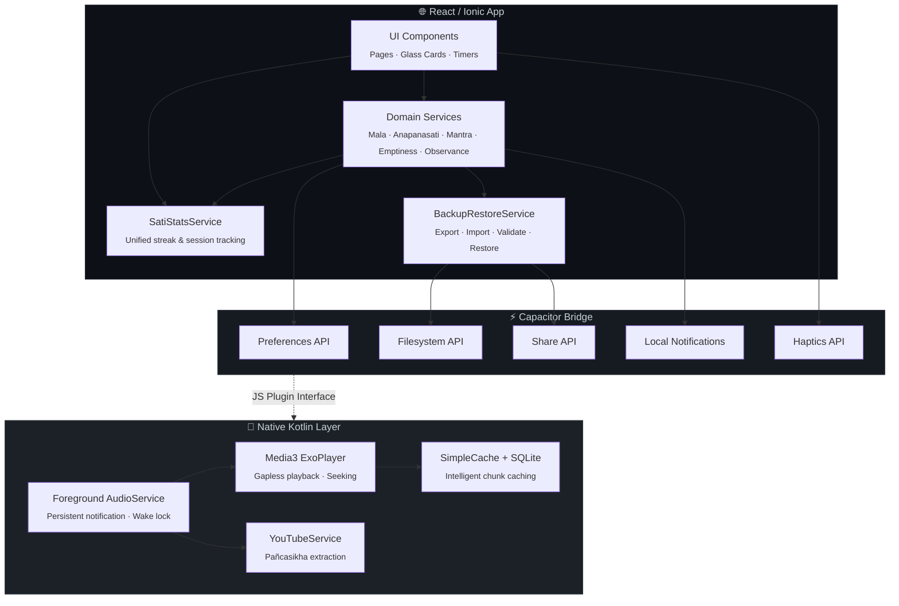

<div align="center">
  <br>
  
  <br><br>

  # 🪷 Uposath

  **A Modern Sanctuary for Buddhist Practice & Observance**

  *Bridging ancient Dhamma wisdom with state-of-the-art mobile technology*

  <br>

  [](https://opensource.org/licenses/MIT)
  [](https://ionicframework.com/)
  [](https://reactjs.org/)
  [](https://www.typescriptlang.org/)
  [](https://developer.android.com/)
  [](https://kotlinlang.org/)

  <br>

  <sub>*"Appamādo amatapadaṃ" — Heedfulness is the path to the Deathless.*<br>— Dhammapada 21</sub>

</div>

<br>

---

<details>
<summary><b>📖 Table of Contents</b></summary>

- [Overview](#-overview)
- [Feature Showcase](#-feature-showcase)
- [Tech Stack & Architecture](#%EF%B8%8F-tech-stack--architecture)
- [Project Structure](#-project-structure)
- [Getting Started](#-getting-started)
- [Available Scripts](#-available-scripts)
- [Data & Backup](#-data--backup)
- [Contributing](#-contributing)
- [Acknowledgments](#-acknowledgments)
- [License](#-license)

</details>

---

## 🌟 Overview

**Uposath** is a premium, open-source mobile application crafted for Buddhist practitioners. It provides an integrated suite of tools for tracking **Uposatha observance days**, engaging with ancient meditation techniques, studying the **Dhammapada**, and listening to curated Dhamma audio — all wrapped in a serene **dark glassmorphism** interface designed to minimize distraction and maximize mindfulness.

> 🧘 *One app. All traditions. Daily practice, beautifully tracked.*

### Why Uposath?

| 💡 Problem | ✅ Uposath Solution |
|---|---|
| Scattered lunar calendars for different traditions | Unified engine for **Theravāda**, **Mahāyāna** (Chinese lunar), and **Vajrayāna** (Tibetan lunar) |
| No way to track observance consistency | Visual heatmaps, streaks, and moon-phase breakdown statistics |
| Generic meditation timers | Purpose-built **Ānāpānasati** and **Śūnyatā** timers with zen bell cues and step guidance |
| Mantra counters lack depth | Digital mālā with custom deity mantras, per-mantra stats, and tradition tagging |
| Dhamma audio needs multiple apps | Native background playback with **ExoPlayer**, intelligent caching, and YouTube integration |

---

## ✨ Feature Showcase

### 🌕 Uposatha & Lunar Calendar

- **Astronomical Moon Phase Engine** — Highly accurate lunisolar calculations using the `astronomy-engine` library
- **Multi-Tradition Support** — Theravāda (Pāli), Mahāyāna (Chinese `chinese-lunar-calendar`), Vajrayāna (Tibetan lookup tables)
- **Vedic Pañcāṅga** — Deep astrology layer with *Horā*, *Graha* positions, and *Nakṣatra* data via `panchangam-js`
- **Observance Tracker** — Log every Uposatha as observed/skipped, record precepts kept, practice minutes, quality, and reflections
- **Festival Calendar** — Annual Buddhist festivals across all three traditions with live countdown timers

### 🧘 Sati (Mindfulness) Suite

A unified practice backend tracks your daily streaks across all disciplines:

| Practice | Description |
|---|---|
| **Ānāpānasati** | 16-step breath meditation timer with tetrad-based step progression, interval bells, and session reflection |
| **Tiratana Recollection** | Structured *Buddhānussati*, *Dhammānussati*, *Saṅghānussati* with Pāli & Devanāgarī script support |
| **Digital Mālā** | Versatile bead counter supporting Buddha, Dhamma, Sangha recollection with haptic feedback |
| **Śūnyatā Bhāvanā** | Emptiness contemplation with guided sections — Five Aggregates (Anattā), Heart Sūtra, and more |
| **Custom Mantras** | Create personalized mantra practices with deity association, tradition tagging, and per-mantra statistics |

### 📖 Dhammapada

- **Complete Dhammapada** — All 423 verses with Max Müller English translations + Pāli originals
- **Daily Verse Notifications** — Persistent sunrise notification delivering a verse for daily reflection
- **Transliteration Engine** — Seamlessly switch between Roman and Devanāgarī scripts

### 🎧 Dhamma Audio Library

- **Native Background Playback** — Gapless audio powered by a custom **Media3 (ExoPlayer)** Kotlin service
- **Intelligent Chunk Caching** — Automatically caches audio during streaming for offline replay
- **YouTube Integration** — Converts video Dhamma talks (via the *Pañcasikha* library) into background-playable audio
- **Playlist System** — Organize talks into playlists with chapter navigation

### 📊 Unified Statistics

- **Global Dashboard** — Total sessions, beads counted, and current streak across all practices
- **Per-Practice Analytics** — Detailed breakdowns per meditation type with focus area distribution
- **Session History** — Complete chronological log with edit/delete capability

### 💾 Backup & Restore

- **Full JSON Export** — One-tap backup of all observances, sessions, mantras, and preferences
- **Native Share Sheet** — Send backups to Google Drive, email, WhatsApp, or any app
- **Validated Restore** — Import with item-count confirmation dialog before overwriting

---

## 🛠️ Tech Stack & Architecture

### Core Technologies

| Layer | Technology | Purpose |
|---|---|---|
| **Frontend** | React 19 + Ionic 8 | UI components & routing |
| **Language** | TypeScript 5.9 | Type-safe application logic |
| **Build** | Vite 5 | Lightning-fast HMR & bundling |
| **Native Bridge** | Capacitor 8 | Web ↔ Android bridge |
| **Android** | Kotlin + Media3 | Background audio, native features |
| **Storage** | `@capacitor/preferences` | JSON-based persistent storage |
| **Styling** | Vanilla CSS | Glassmorphism + CSS custom properties |

### Capacitor Plugins

```
@capacitor/app            — App lifecycle
@capacitor/preferences    — Key-value storage
@capacitor/filesystem     — File I/O for backup export
@capacitor/share          — Native share sheet
@capacitor/local-notifications — Uposatha, festival & verse alerts
@capacitor/haptics        — Mālā bead feedback
@capacitor/keyboard       — Input management
@capacitor/status-bar     — Immersive dark UI
```

### Architecture Diagram



---

## 📁 Project Structure

```
uposath/
├── android/                    # Native Android project (Kotlin)
│   └── app/src/main/kotlin/    # ExoPlayer AudioService, YouTubeService
├── public/
│   └── assets/audio/           # Zen bell sound cues
├── src/
│   ├── assets/data/            # Anapanasati, Emptiness, Triple Gem JSON content
│   ├── components/             # Reusable UI components
│   ├── pages/                  # Route-level page components
│   │   ├── CalendarPage.tsx    # Lunar calendar + daily verse
│   │   ├── SatiPage.tsx        # Practice hub
│   │   ├── AnapanasatiSessionPage.tsx
│   │   ├── EmptinessSessionPage.tsx
│   │   ├── MantraPracticePage.tsx
│   │   ├── SatiStatsPage.tsx   # Unified statistics dashboard
│   │   ├── AudioLibraryPage.tsx
│   │   ├── FestivalsPage.tsx
│   │   └── SettingsPage.tsx    # Config, notifications, backup/restore
│   ├── services/               # Business logic layer
│   │   ├── UposathaObservanceService.ts
│   │   ├── MalaService.ts
│   │   ├── AnapanasatiService.ts
│   │   ├── MantraService.ts
│   │   ├── EmptinessService.ts
│   │   ├── SatiStatsService.ts
│   │   ├── BackupRestoreService.ts
│   │   ├── uposathaCalculator.ts
│   │   ├── buddhistFestivalService.ts
│   │   └── notificationScheduler.ts
│   ├── types/                  # TypeScript interfaces
│   │   ├── ObservanceTypes.ts
│   │   └── SatiTypes.ts
│   └── theme/                  # CSS variables & global styles
├── capacitor.config.ts
├── vite.config.ts
└── package.json
```

---

## 🚀 Getting Started

### Prerequisites

| Tool | Version | Purpose |
|---|---|---|
| [Node.js](https://nodejs.org/) | ≥ 18.0 | JavaScript runtime |
| [Android Studio](https://developer.android.com/studio) | SDK 34+ | Native build & emulator |
| Git | Latest | Version control |

### Installation

```bash
# 1. Clone the repository
git clone https://github.com/Stonks007/uposath.git
cd uposath

# 2. Install dependencies
npm install

# 3. Start the dev server (browser preview)
npm run dev

# 4. Build & deploy to Android device/emulator
npm run build
npx cap sync android
npx cap run android
```

> **💡 Tip:** Open the native project directly in Android Studio for Kotlin debugging:
> ```bash
> npx cap open android
> ```

---

## 📜 Available Scripts

| Script | Command | Description |
|---|---|---|
| **Dev** | `npm run dev` | Start Vite dev server + proxy server |
| **Frontend** | `npm run frontend` | Vite dev server only |
| **Build** | `npm run build` | TypeScript check + production Vite bundle |
| **Preview** | `npm run preview` | Preview the production build locally |
| **Unit Tests** | `npm run test.unit` | Run Vitest unit tests |
| **E2E Tests** | `npm run test.e2e` | Run Cypress end-to-end tests |
| **Lint** | `npm run lint` | ESLint check |

---

## 💾 Data & Backup

All user data is stored locally via `@capacitor/preferences`. Nothing leaves the device unless you explicitly export.

### Storage Keys

| Key | Data |
|---|---|
| `uposatha_observance_entries` | Uposatha observance logs |
| `sati_mala_entries` | Triple Gem mālā bead sessions |
| `sati_mala_preferences` | Quick-button config, language prefs |
| `anapanasati_sessions` | Ānāpānasati meditation sessions |
| `anapanasati_settings` | Timer & bell defaults |
| `user_mantras` | Custom mantras + stats |
| `mantra_sessions` | Mantra practice sessions |
| `emptiness_sessions` | Śūnyatā contemplation sessions |

### Backup Format

Exported as a versioned JSON file (`uposatha_backup_YYYY-MM-DD.json`):

```json
{
  "version": 1,
  "appVersion": "0.1.0-alpha",
  "createdAt": "2026-02-22T10:00:00.000Z",
  "data": {
    "uposathaObservances": [],
    "malaEntries": [],
    "malaPreferences": {},
    "anapanasatiSessions": [],
    "anapanasatiSettings": {},
    "mantras": [],
    "mantraSessions": [],
    "emptinessSessions": []
  }
}
```

---

## 🤝 Contributing

Contributions are warmly welcomed! Whether it's fixing a bug, adding a new meditation technique, or translating content into a new language — every effort helps the Dhamma reach further.

1. **Fork** this repository
2. **Create** a feature branch: `git checkout -b feature/loving-kindness-timer`
3. **Commit** your changes: `git commit -m 'feat: add metta bhavana timer'`
4. **Push** to the branch: `git push origin feature/loving-kindness-timer`
5. **Open** a Pull Request

### Areas for Contribution

- 🌍 **Translations** — Add Hindi, Sinhala, Thai, Burmese, or Mandarin translations
- 🧘 **New Practices** — Mettā Bhāvanā, Walking Meditation, Body Scan
- 📖 **Sutta Content** — Additional canonical texts and commentaries
- 🎨 **Themes** — New color palettes and visual themes
- 🐛 **Bug Fixes** — See [Issues](https://github.com/Stonks007/uposath/issues)

---

## 🙏 Acknowledgments

- **Dhammapada** texts sourced from [Project Gutenberg](https://www.gutenberg.org/) (public domain, Max Müller translation)
- **Astronomical calculations** via [`astronomy-engine`](https://github.com/cosinekitty/astronomy)
- **Vedic Pañcāṅga** via [`panchangam-js`](https://github.com/ishubhamx/panchangam-js)
- **Chinese Lunar Calendar** via [`chinese-lunar-calendar`](https://www.npmjs.com/package/chinese-lunar-calendar)
- Built with [Ionic Framework](https://ionicframework.com/) and [Capacitor](https://capacitorjs.com/)

---

## 📜 License

Distributed under the **MIT License**. See [`LICENSE`](LICENSE) for full details.

This software is offered freely in the spirit of *Dāna* (generosity) — may it support your practice and benefit all beings.

---

<div align="center">
  <br>
  <sub>

  *Bhavatu Sabba Maṅgalaṃ*
  *May all beings be well, happy, and peaceful.* 🙏

  </sub>
  <br><br>

  **[⬆ Back to Top](#-uposath)**

</div>
