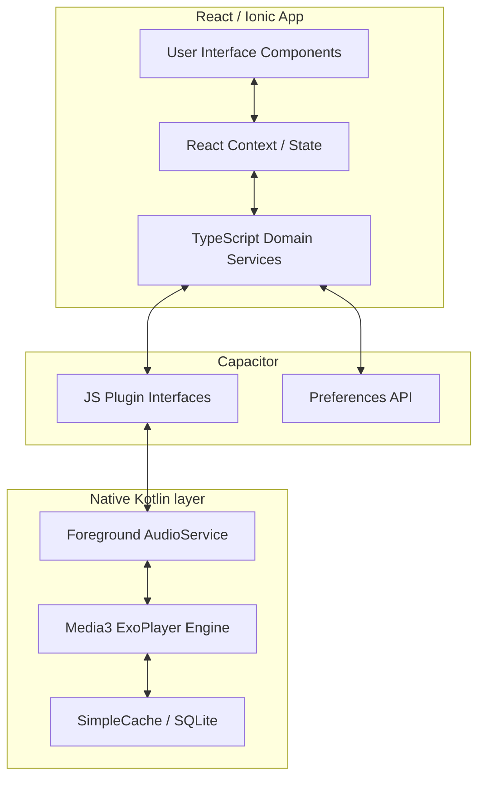

<div align="center">
  
  <h1>Uposath</h1>
  <p><strong>A Modern Sanctuary for Buddhist Practice & Observance</strong></p>

  <p>
    <a href="https://opensource.org/licenses/MIT"></a>    
    <a href="https://ionicframework.com/"></a>
    <a href="https://reactjs.org/"></a>
    <a href="https://www.typescriptlang.org/"></a>
    <a href="https://developer.android.com/"></a>
    <a href="https://kotlinlang.org/"></a>
  </p>

  <p>
    <i>"A quiet mind is all you need."</i>
  </p>
</div>

---

## 📖 Table of Contents
- [🌟 Overview](#-overview)
- [✨ Key Features](#-key-features)
- [🛠️ Tech Stack & Architecture](#️-tech-stack--architecture)
- [🚀 Getting Started](#-getting-started)
- [🤝 Contributing](#-contributing)
- [📜 License](#-license)

---

## 🌟 Overview

**Uposath** is a minimalist, premium mobile application designed to help practitioners track Buddhist observance days (*Uposatha*), engage with Dhamma teachings, and maintain a consistent meditation practice. 

Built with modern web technologies and bridged to powerful native Android APIs, Uposath aims to seamlessly combine ancient wisdom with state-of-the-art mobile technology. The interface features a bespoke dark glassmorphism design, providing a serene and distraction-free environment for your daily practice.

---

## ✨ Key Features

### 🌺 Uposatha & Festivals
*   **Lunar Calendar Engine**: Highly accurate moon phase tracking supporting Theravada, Mahayana (Chinese lunar), and Vajrayana (Tibetan lunar) traditions.
*   **Deep Astrology**: Detailed Vedic Panchang data including *Horas*, *Graha* positions, and planetary movements.
*   **Practice Logging**: Track your monthly observances, log whether days were observed or skipped, and review beautiful statistical heatmaps.

### 🎧 Dhamma Audio Library
*   **Native Background Playback**: High-quality, gapless audio streaming powered by a custom native Android **Media3 (ExoPlayer)** implementation.
*   **Intelligent Caching**: Listen to your favorite talks entirely offline. The app automatically caches audio chunks during streaming to save bandwidth on repeat listens.
*   **YouTube Integration**: Seamless integration with the *Pañcasikha* library, converting video resources into background-playable audio sermons.

### 🧘 Sati (Mindfulness) Suite
A unified backend stores your unified practice history, intelligently tracking your daily streaks across all disciplines:
*   **Anapanasati Timer**: Guided breath meditation timer with interval bells and session tracking.
*   **Digital Mala**: A versatile mantra counter with haptic feedback, supporting default presets and custom deity practices.
*   **Emptiness Contemplation**: Structural flashcards and thematic guidance for deep analytical meditation (e.g. The Five Aggregates, The Heart Sutra).
*   **Tiratana Recollection**: Dedicated modules perfectly formatted for *Buddhānussati*, *Dhammānussati*, and *Saṅghānussati* charting.

---

## 🛠️ Tech Stack & Architecture

Uposath utilizes a hybrid layered architecture, leveraging the speed of web-ui development while retaining the raw power of native Android APIs for intensive tasks like background service audio.

### Technologies
-   **Frontend**: React (Functional Components, Hooks), Ionic Framework UI, Vite
-   **Native Bridge**: CapacitorJS
-   **Android Layer**: Kotlin, AndroidX Media3 (ExoPlayer), Android Room/Preferences
-   **Styling**: Vanilla CSS featuring CSS Variables, Glassmorphism, and dynamic palette swapping.

### System Diagram



---

## 🚀 Getting Started

Follow these steps to set up the Uposath development environment on your local machine.

### Prerequisites
*   [Node.js](https://nodejs.org/) (v18.0.0 or higher)
*   [Android Studio](https://developer.android.com/studio) (with Android SDK 34+)
*   Git

### Installation

1. **Clone the repository**
   ```bash
   git clone https://github.com/Stonks007/uposath.git
   cd uposath
   ```

2. **Install dependencies**
   ```bash
   npm install
   ```

3. **Start the Development Server**
   Runs the app locally in your browser for rapid UI iteration.
   ```bash
   npm run dev
   ```

4. **Build & Deploy to Android Emulator**
   Compiles the Vite bundle, synchronizes the native Capacitor bridge, and launches the Android Studio emulator.
   ```bash
   npm run build
   npx cap sync android
   npx cap run android
   ```
   *(Note: You can open the project directly in Android Studio via `npx cap open android` for robust Kotlin debugging).*

---

## 🤝 Contributing

Contributions are what make the open source community such an amazing place to learn, inspire, and create. Any contributions you make are **greatly appreciated**.

1. Fork the Project
2. Create your Feature Branch (`git checkout -b feature/AmazingSutta`)
3. Commit your Changes (`git commit -m 'Add some AmazingSutta'`)
4. Push to the Branch (`git push origin feature/AmazingSutta`)
5. Open a Pull Request

---

## 📜 License

Distributed under the MIT License. See `LICENSE` for more information.

---

<p align="center">
  <br>
  <i>Bhavatu Sabba Mangalaṃ<br>May all beings be well, happy, and peaceful.</i>
</p>
