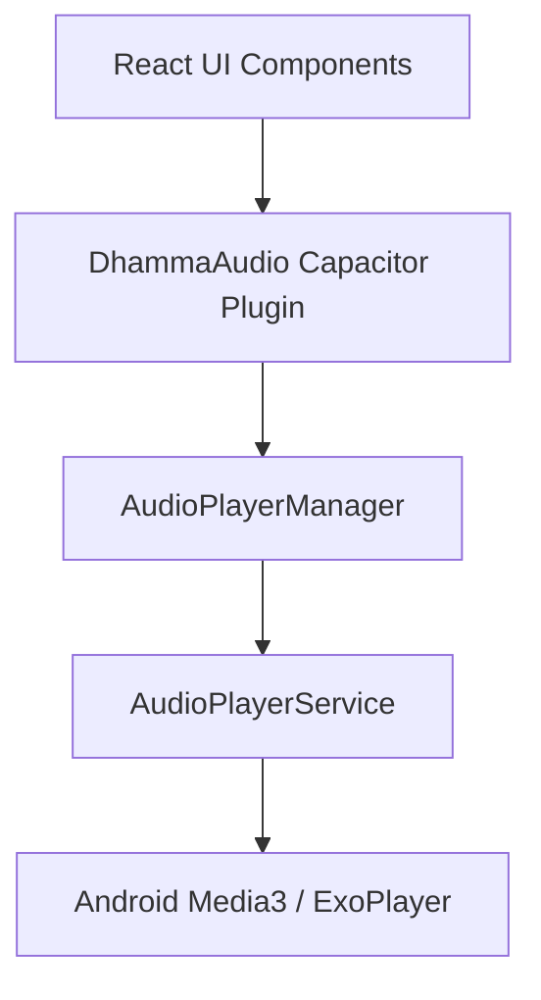

<div align="center">
  
  <h1>Uposath</h1>
  <p><strong>A Modern Sanctuary for Buddhist Practice & Observance</strong></p>

  [](https://opensource.org/licenses/MIT)
  [](https://ionicframework.com/)
  [](https://developer.android.com/)
  [](https://kotlinlang.org/)
</div>

---

## 🌟 Overview

**Uposath** is a minimalist, premium mobile application designed to help practitioners track Buddhist observance days (*Uposatha*), engage with Dhamma teachings, and maintain a consistent meditation practice. It combines ancient wisdom with modern mobile technology.

## 🌙 Key Features

### 📅 Uposatha & Panchang Tracking
- **Lunar Calendar**: Stay aligned with the moon phases and major Buddhist festivals.
- **Deep Astrology**: Detailed Panchang data including *Horas*, *Graha* positions, and planetary movements.
- **Observance Log**: Track your practice by marking Uposatha days as *Observed* or *Skipped* with detailed stats.

### 🎧 Dhamma Library
- **Background Playback**: High-quality audio streaming of Dhamma talks using a custom native Android implementation (Media3).
- **Offline Reliability**: Integrated caching system for smooth listening even with spotty connectivity.
- **YouTube Integration**: Direct access to teachings from the *Pañcasikha* library.

### 🧘 Sati (Mindfulness) Suite
- **Anapanasati Timer**: Guided meditation sessions with detailed statistics and progress tracking.
- **Mala Counter**: Digital mantra counter to aid in repetitive mindfulness practices.
- **Emptiness & Tetrad Cards**: Thematic guidance for deep contemplation.

## 🛠️ Technical Stack

- **Frontend**: [Ionic Framework](https://ionicframework.com/) + [React](https://reactjs.org/) + [TypeScript](https://www.typescriptlang.org/)
- **Native Bridge**: [Capacitor](https://capacitorjs.com/) with custom native plugins.
- **Android Layer**: Written in **Kotlin**, utilizing **Android Media3 (ExoPlayer)** for rock-solid audio performance.
- **Styling**: Modern CSS with glassmorphism and premium gradients.
- **Build Tool**: [Vite](https://vitejs.dev/)

## 🚀 Getting Started

### Prerequisites
- Node.js (v18+)
- Android Studio (with SDK 34+)
- Capacitor CLI

### Installation

1. **Clone the repository**
   ```bash
   git clone https://github.com/Stonks007/uposath.git
   cd uposath
   ```

2. **Install dependencies**
   ```bash
   npm install
   ```

3. **Running in Development**
   ```bash
   npm run dev
   ```

4. **Building for Android**
   ```bash
   npx cap sync android
   cd android
   ./gradlew assembleDebug
   ```

## 📐 Architecture

Uposath uses a layered architecture to bridge the gap between high-level web components and low-level system services:



## 📜 License

Distributed under the MIT License. See `LICENSE` for more information.

---

<p align="center">
  <i>May all beings be well, happy, and peaceful.</i>
</p>
